<h1 style="text-align:center;">REPOSITÓRIO DO BEM</h1>

<h4 style="text-align:center;">
  A fome é um problema que afeta milhões de pessoas ao redor do mundo. Os fatores que causam essa dificuldade são inúmeros, incluindo a má distribuição de alimentos. Não é preciso ir muito longe para encontrar pessoas em situação de insegurança alimentar, na própria cidade de Diadema é possível identificar pessoas que estão na situação de insegurança alimentar.
</h4>

<h4 style="text-align:center;">
  Pensando nisso e analisando os temas da ODS, foi escolhido o tema "Fome Zero e Agricultura Sustentável", destacando-se a meta 2.1 que estabelece o objetivo de acabar com a fome até 2030 e garantir o acesso de todas as pessoas, especialmente os pobres e vulneráveis, incluindo crianças, a alimentos seguros, nutritivos e suficientes durante todo o ano. Ao analisarmos nosso entorno, foi proposta a ideia de desenvolver um software para instituições que são ponto de coleta e distribuição de doações de cestas às pessoas que precisam.
</h4>

<h4 style="text-align:center;">
  A proposta do software é um sistema de estoque para o gerenciamento das doações recebidas, trazendo mais segurança e credibilidade a esse processo. É dessa forma que o grupo busca contribuir com esse objetivo da ODS.
</h4>

<h2 style="text-align:center;">ITENS NECESSÁRIOS</h2>
<h5>
    <ul>
        <li>Maven - 3.9.6</li>
        <li>JAVA - 22</li>
        <li>MONGODB - 4.00</li>
    </ul>
</h5>

<h2 style="text-align:center;">TECNOLOGIAS UTILIZADAS</h2>
<h5>
    <ul>
        <li>IntelliJ</li>
        <li>Vs Code</li>
        <li>HTML & CSS</li>
        <li>Javascript</li>
        <li>Java</li>
        <li>MongoDB</li>
        <li>SPRING FRAMEWORK</li>
        <li>Thunder Client</li>
    </ul>
</h5>

<h2 style="text-align:center;">INSTALAÇÃO</h2>

Faça o download:

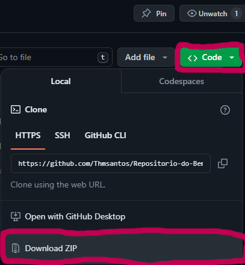

<h2 style="text-align:center;">EXECUÇÃO</h2>

<h4>Abrindo o Banco de Dados</h4>

Abra o mongoDB

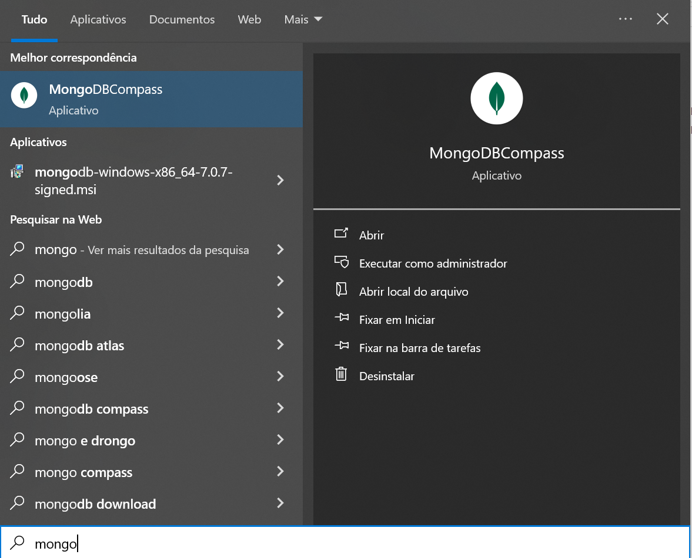

Faça a conexão

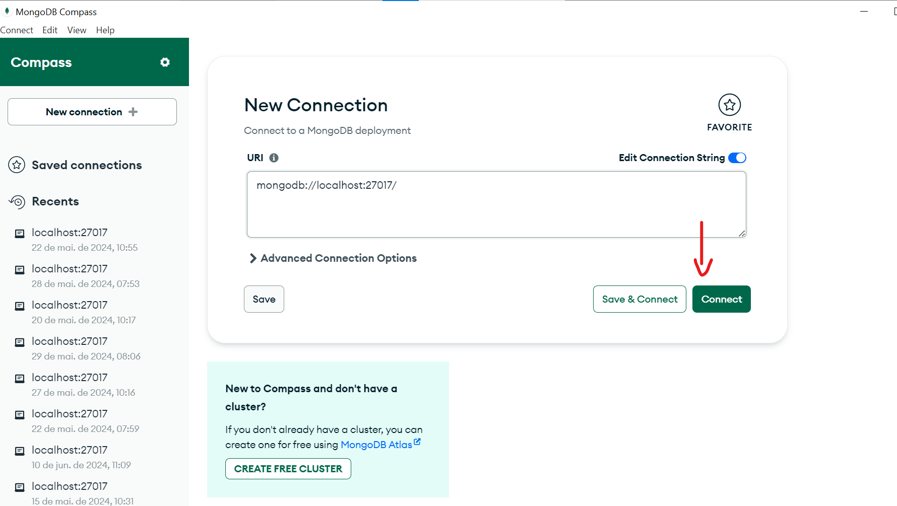

<h4>Rodando o servidor</h4>

Extraia os arquivos:

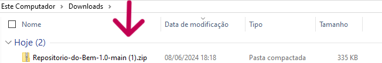

Pasta extraida:

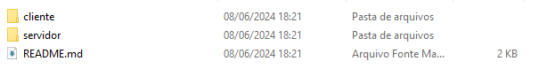

Abra o prompt de comando da pasta

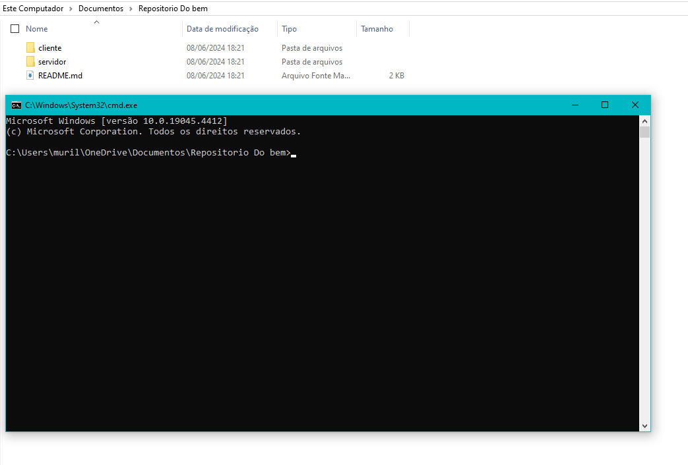

  digite os seguintes comandos:
  <ul>
    <li>cd Servidor -> (entra na pasta do servidor)</li>
    <li>cd RepositorioDoBem -> (entra no servidor)</li>
    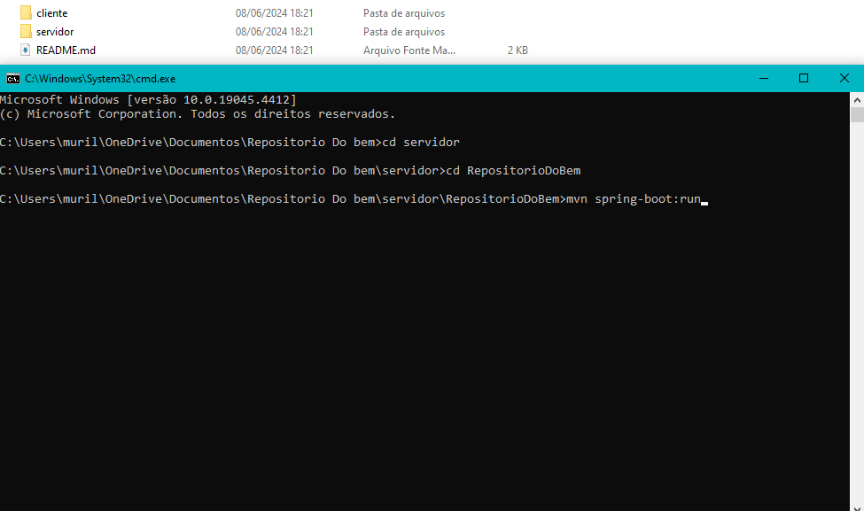
    <li>mvn spring-boot:run -> (executa o servidor)</li>
    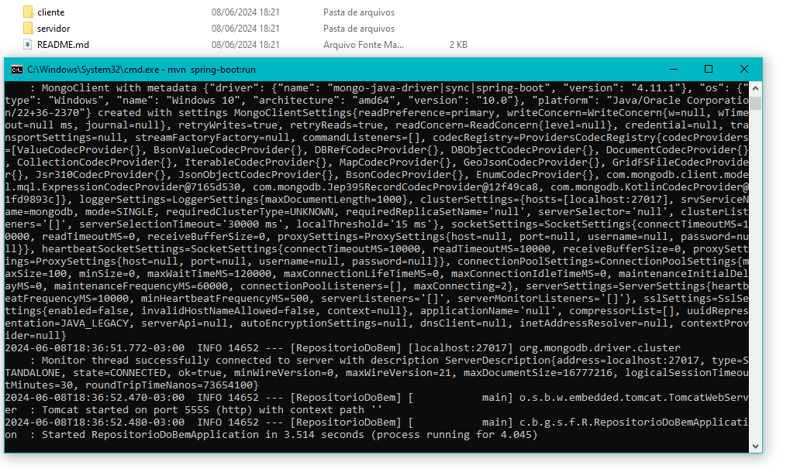
  <ul>

Após executar o servidor, abra a pasta "cliente"

Abra a pasta "Home"

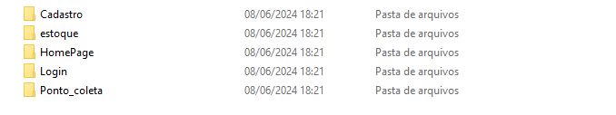

Execute o arquivo Index.html

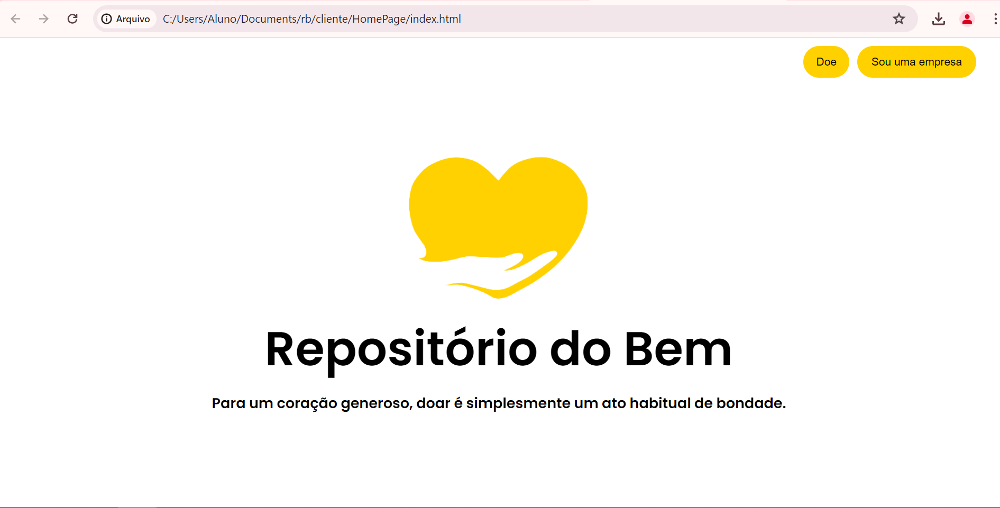

<h2>Para receptores e doadores</h2>
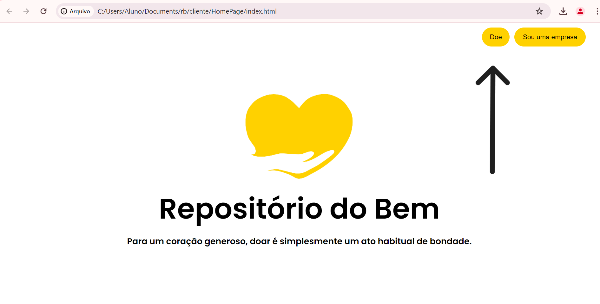

Pontos de coleta e doação no mapa e legendados

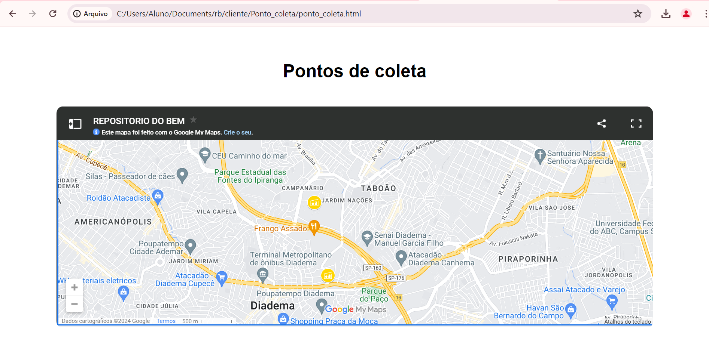

<h2>Para empresas</h2>
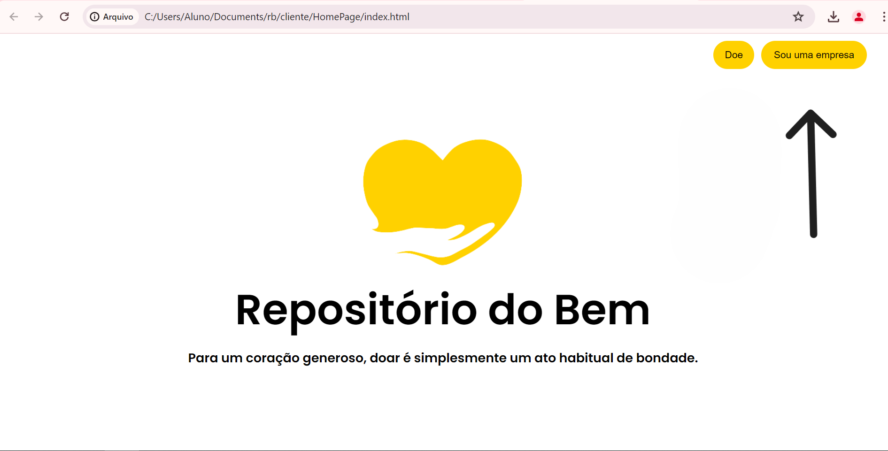
